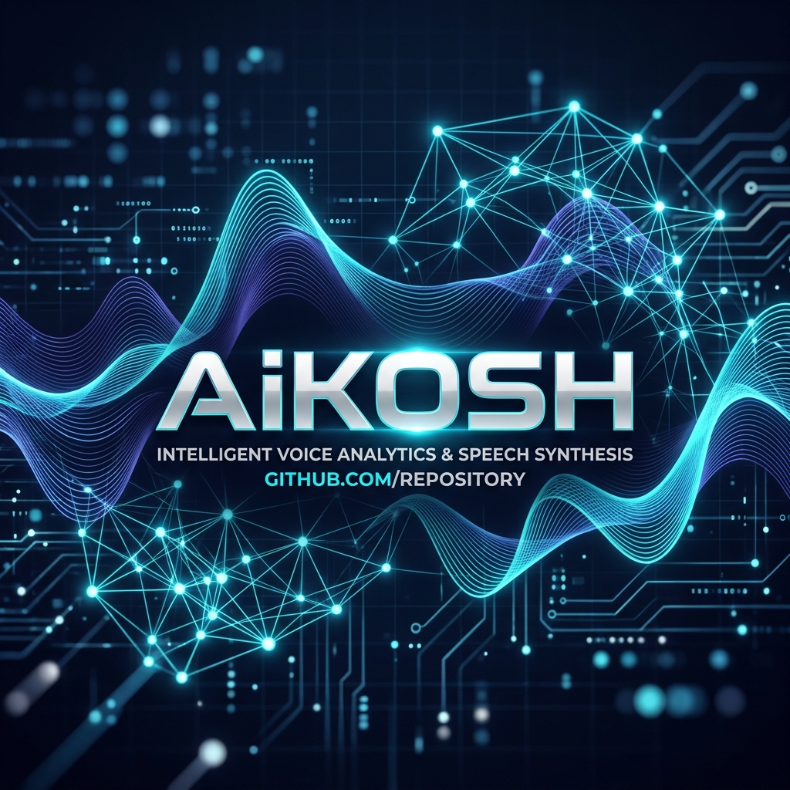
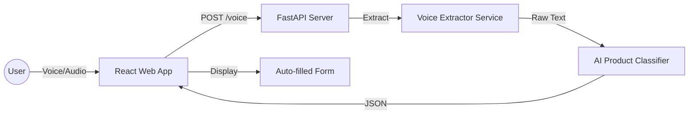

# 🎙️ AiKOSH | AI Voice Form Auto-Fill System

<p align="center">
  
</p>

<p align="center">
  <a href="https://reactjs.org/"></a>
  <a href="https://fastapi.tiangolo.com/"></a>
  <a href="https://vitejs.dev/"></a>
  <a href="https://www.python.org/"></a>
</p>

---

## 📖 Overview

**AiKOSH** is a cutting-edge **AI-powered voice extraction and categorization system** designed to streamline small business onboarding. By leveraging advanced Natural Language Processing (NLP) and Audio Analysis, AiKOSH automatically extracts product data from voice transcripts and categorizes them with high precision, eliminating manual data entry.

Whether it's a casual voice note about a new product or a formal description, AiKOSH processes the audio, extracts key attributes, and maps them to a structured catalog in real-time.

---

## ✨ Key Features

- **🗣️ Voice-to-Data Extraction:** Seamlessly convert spoken product descriptions into structured JSON data.
- **🏷️ Intelligent Categorization:** Multi-layered classification engine that maps products to predefined business categories.
- **⚡ Real-time Transcription:** Live visual feedback of the transcription process for immediate validation.
- **🧩 Modular Architecture:** Separate, high-performance Backend (FastAPI) and Frontend (React + Vite) modules.
- **📊 Form Auto-Fill:** Automatically populates complex business forms from simple voice inputs.

---

## 🏗️ System Architecture



---

## 🛠️ Tech Stack

| Component | Technology |
| :--- | :--- |
| **Frontend** | React, Vite, Framer Motion, CSS3 |
| **Backend** | FastAPI, Python 3.10+, Uvicorn |
| **AI/NLP** | Custom Logic & ML Classifiers |
| **Data Storage** | JSON-based Catalog Systems |
| **Deployment** | Vercel (Frontend), FastAPI (Backend) |

---

## 🚀 Installation & Setup

### 1. Clone the Project
```bash
git clone https://github.com/AnmolGarg8/AiKOSH.git
cd AiKOSH
```

### 2. Backend Setup
```bash
cd ai-product-categorization/backend
python -m venv venv
source venv/bin/activate # Windows: .\venv\Scripts\activate
pip install -r requirements.txt
uvicorn main:app --reload
```

### 3. Frontend Setup
```bash
cd ../frontend
npm install
npm run dev
```

---

## 📁 Project Structure

```text
AiKOSH/
└── ai-product-categorization/
    ├── backend/           # FastAPI Application
    │   ├── routers/       # API Routes (Voice, Categorization)
    │   ├── services/      # Business Logic (Extractors, Classifiers)
    │   └── data/          # Product Catalogs
    └── frontend/          # React Vite Application
        ├── src/           # Component Logic
        └── public/        # Static Assets
```

---

## 🤝 Contributing

We welcome contributions to make AiKOSH even better!

1. Fork the Project
2. Create your Feature Branch (`git checkout -b feature/NewFeature`)
3. Commit your Changes (`git commit -m 'Add some NewFeature'`)
4. Push to the Branch (`git push origin feature/NewFeature`)
5. Open a Pull Request

---

## 📝 License

Distributed under the MIT License. See `LICENSE` for more information.

---

<p align="center">
  Built with precision by <a href="https://github.com/AnmolGarg8">Anmol Garg</a>
</p>
